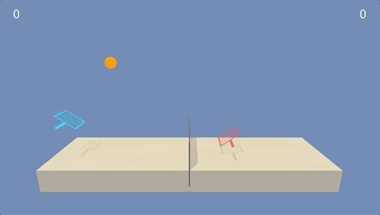

# Tennis Colaboration

This is a code for 3nd project in Udacity Deep Reinforcement Learning Nanodegree. I did my take on Multi Agent Deep Deterministic Policy Gradient algorithm.



## Environment

Agent was learned on Tennis environment. Environment is solved when average reward of all agents in last 100 episodes is over `0.5`. There are 2 agents, each on the oposite side of the net. The agents need to cooperate to keep the ball in game for as long as they can. The reward is summed and averaged over all agents so it's impossible for one agent to achieve the goal on it's own.

```
Unity brain name: TennisBrain
        Number of Visual Observations (per agent): 0
        Vector Observation space type: continuous
        Vector Observation space size (per agent): 8
        Number of stacked Vector Observation: 3
        Vector Action space type: continuous
        Vector Action space size (per agent): 2
        Vector Action descriptions: ,
```

Each observation for each agent contains of 3 observations from consecutive timesteps. Single timestep contains 8 float values, so 3 frames contatinated is vector with 24 numbers. Each agent has seperate state so the whole state given by environment is `[2, 24]`. 

Each action for each agent consists of 2 float numbers, one to define position on horizontal axis, the other on vertical one.

## Getting started

Make sure you have python 3.6 installed and virtual environment of your choosing activated. Unity has to be installed on your system. Run:

```source ./install.sh```

to install python dependencies.

You can find trained model weights in a `/models` directory. In `by_score` subdirectory are saved models with apropriate score. 

Code for single DDPG agent is in `ddpgagent.py` file and is joined with MADDPG algorithm in `maddpg.file`. 

## Instructions

Run:

```python run.py```

to start algorithm in preview mode with random weights. Use parameters like:

```python run.py --playthroughs=10 --sleep=5 --file_prefix=score_0.02```

`--playthroughs` controls how many times agents will play in a loop, `--sleep` how many seconds script will wait before running. `--file_prefix` is needed to load specific weights files to both agents.

To run algorithm with the best weights I managed to achieve run:

```python run.py --file_prefix=score_4.64```

To run algorithm in a train mode run:

```python run.py --train```

You can load specific checkpoint with `--file_prefix`. Algorithm will use parameters defined in `config.py` file.

## Sources

[1] Original MADDPG paper by OpenAI [Multi-Agent Actor-Critic for Mixed Cooperative-Competitive Environments](https://arxiv.org/pdf/1706.02275.pdf)

[2] Udacity learning materials
