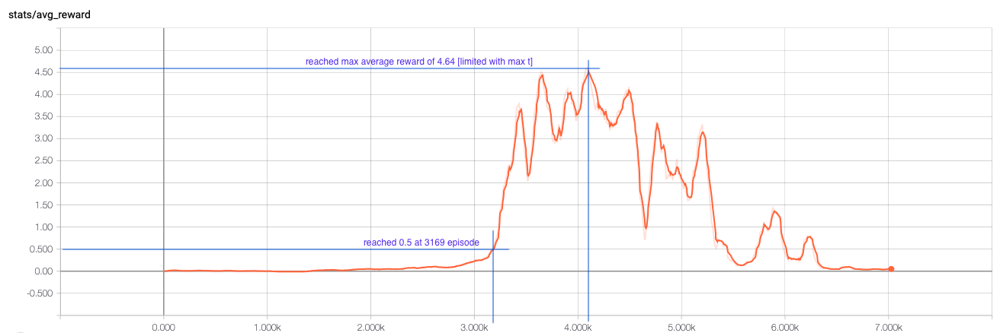
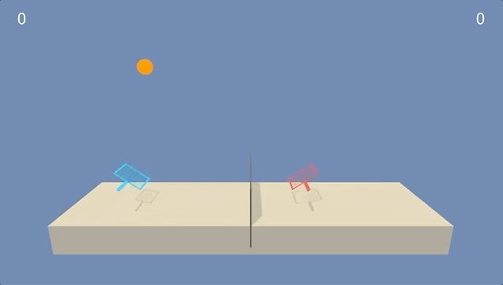
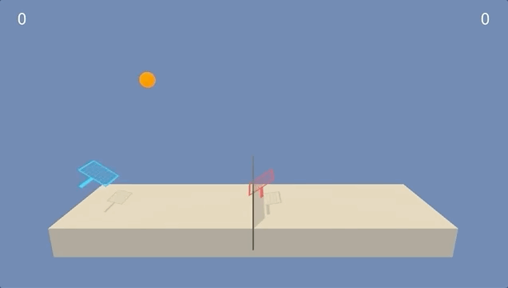
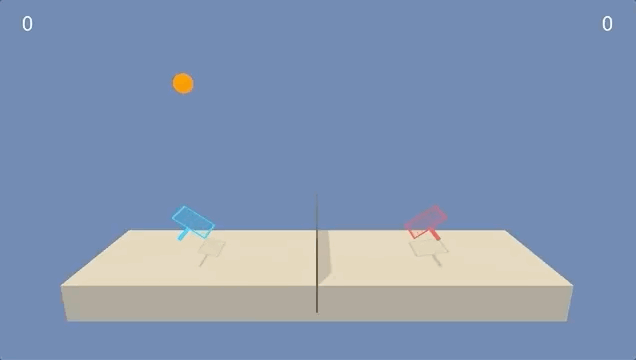

# Project report

## Learning algorithm

The learning algorithm used is Multi Agent Deep Deterministic Policy Gradients (MADDPG) with some tweaks and modification. The algorithm consists of 2 seperate agents each with set of 2 neural networks - actor and critic.

The actor network takes observation as an input and outputs actions. The critic network is used to compute state-action values. It outputs 1 real number - state value estimate for the given agent. It takes actions and observations from each agent as an input.

## Parameters and hyperparameters

You can find full parameters list in verbose form in `config.py` file.

### Neural networks

#### Actor network

- 4 fully connected layers
- 24 input nodes [observation vector size for single agent], 2 output nodes [action vector size], 256 hidden nodes in each layer
- ReLU activations, tanh on last layer
- Learning rate `1e-3`

#### Critic network

- 3 fully connected layers
- 52 input nodes [2 * observation vector size + 2 * action vector size], 1 output nodes, 512 hidden nodes in each layer
- ReLU activations, no activation on last layer
- Learning rate `1e-4`

### Main hyperparameters

- Gamma - `0.99`
- Tau - `1e-3`
- Buffer size - `1e5`
- Batch size - `128`
- Update frequency - `2`

## Modifications

I found `OUNoise` helpful but not enough for strong exploration. I added 100% random actions for the first 1000 episodes and 50% random actions for the following 1000 episodes.

## Results

The chart shows an average reward over 100 consecutive episodes. It's very flat until it explodes as agent cannot reach states with higher values randomly. It takes cooperation to get there. The environment reach required solved level at `3169`th episode. Then it grows very rapidly and reaches maximum observed at `4.64` around 1000 episodes later. Then performance declines. The `4.64` limit is due to limited timesteps per episode (2000). 

First model that solved the environment is saved in `./models/by_score/` directory. The files have prefixes `score_0.50`. The best model is at `score_4.64`.

## Next steps

- **Hyperparameter tuning** - I focused on tuning hidden size and add random exploration. Other parameters might be also good candidates and speed up the training.
- **MAPPO** -  I started this project with my own adaptation of PPO for multi agent. It learned something, but wasn't nearly as good as MADDPG. I would like to make it work
- **Try it on other environment** - Soccer environment sounds like a good idea to tackle.
- **Write generic implementation** - to reuse this repository on other problems and with other libraries (like `Gym`).

## GIFS

### Random

### Score 0.23

### Solved - score 0.5

### Score 2.02

### Score 4.64

